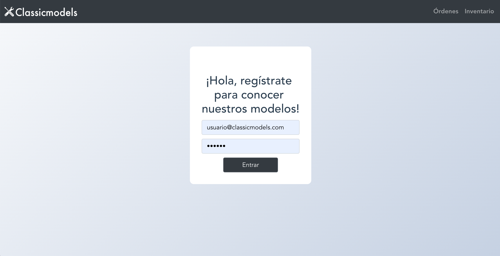
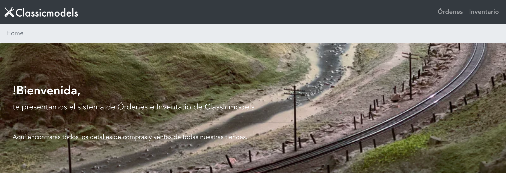
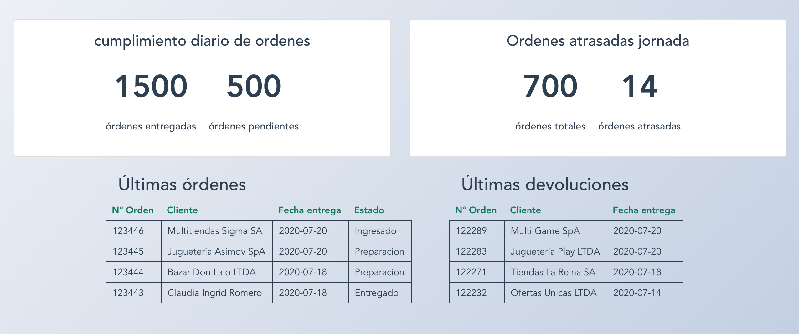
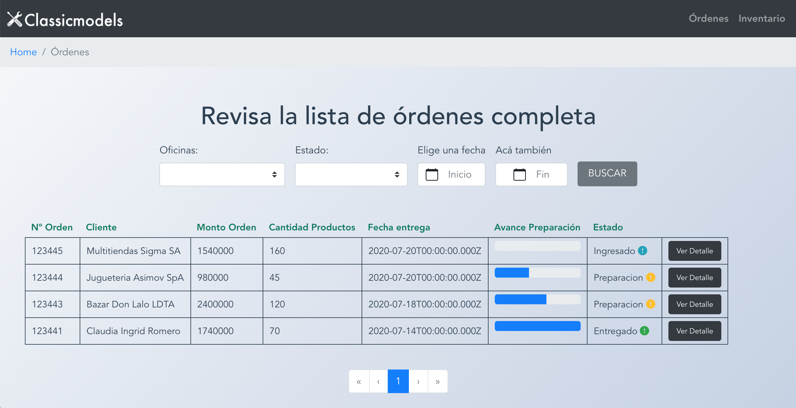
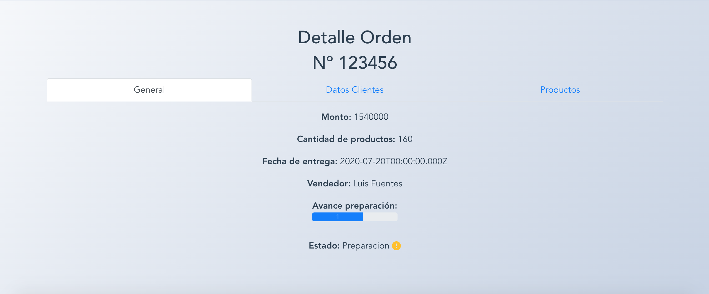

# Classicmodels









## Project setup

```
npm install
```

### Compiles and hot-reloads for development

```
npm run serve
```

### Compiles and minifies for production

```
npm run build
```

### Customize configuration

See [web](https://martita-apel.github.io/Classicmodels/)

email: usuario@classicmodels.com
password: abc123
